# **Checkout Review Evidence**

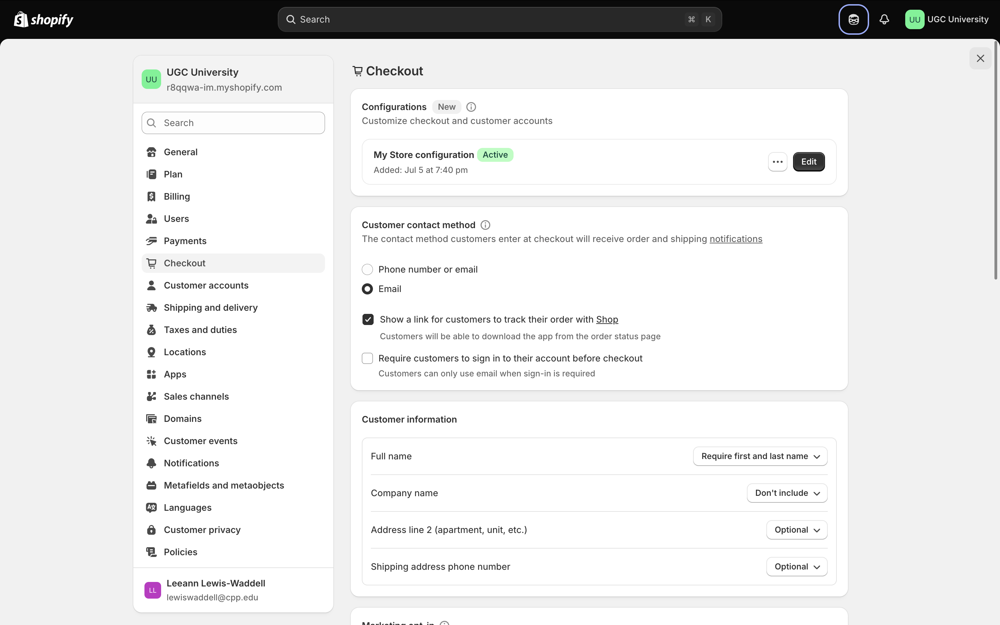

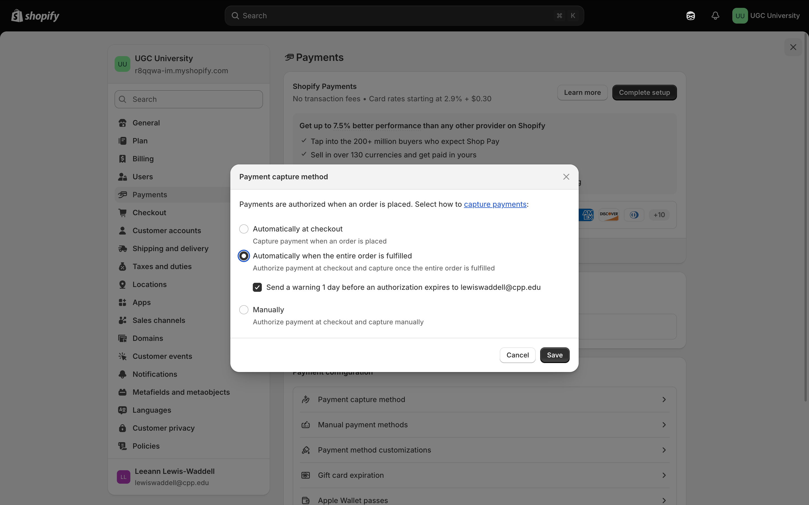

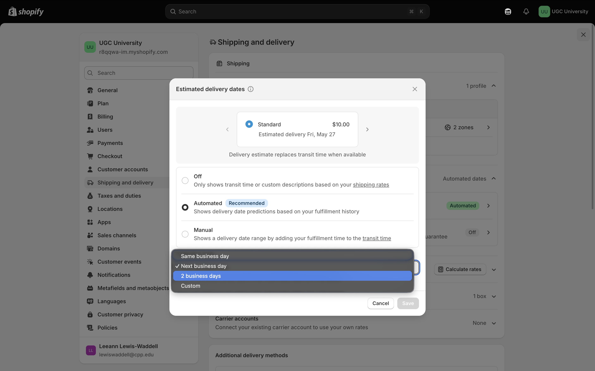\
Shipping Review

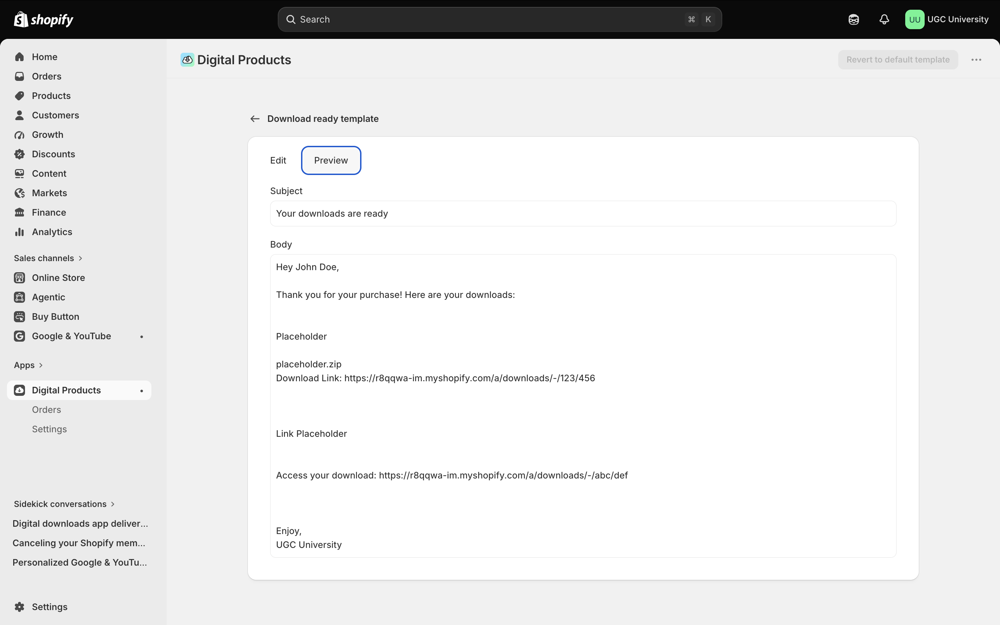

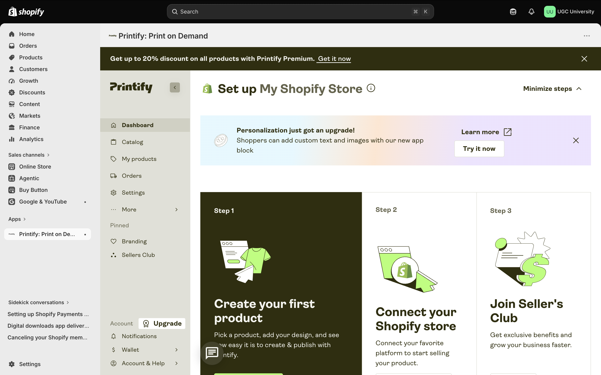

# **Shipping or pickup information**

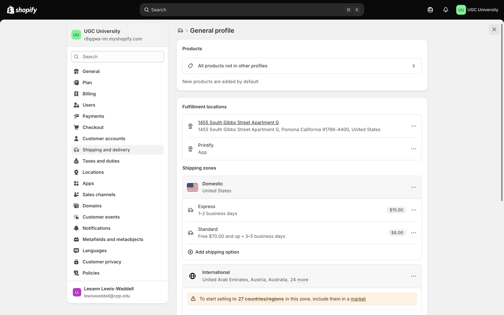

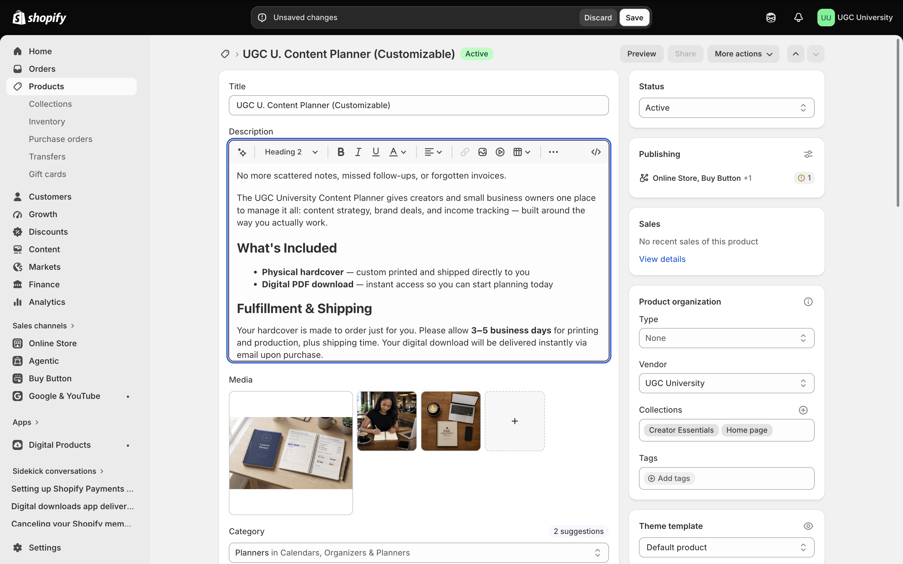

# **Return/refund policy**

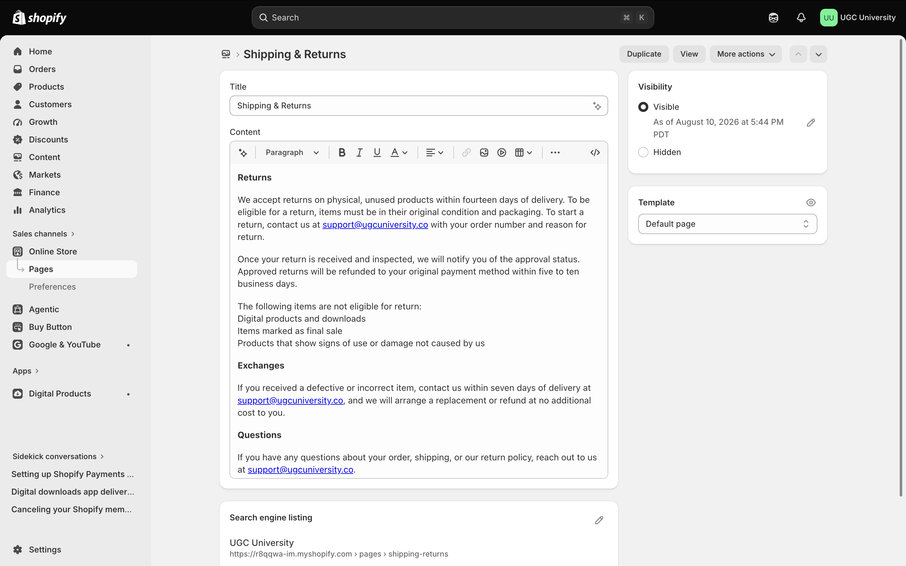

# **Privacy policy or customer data statement**

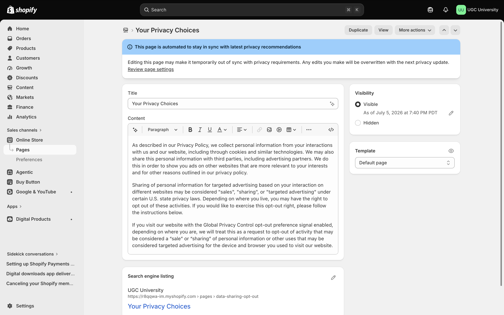

# **Contact information**

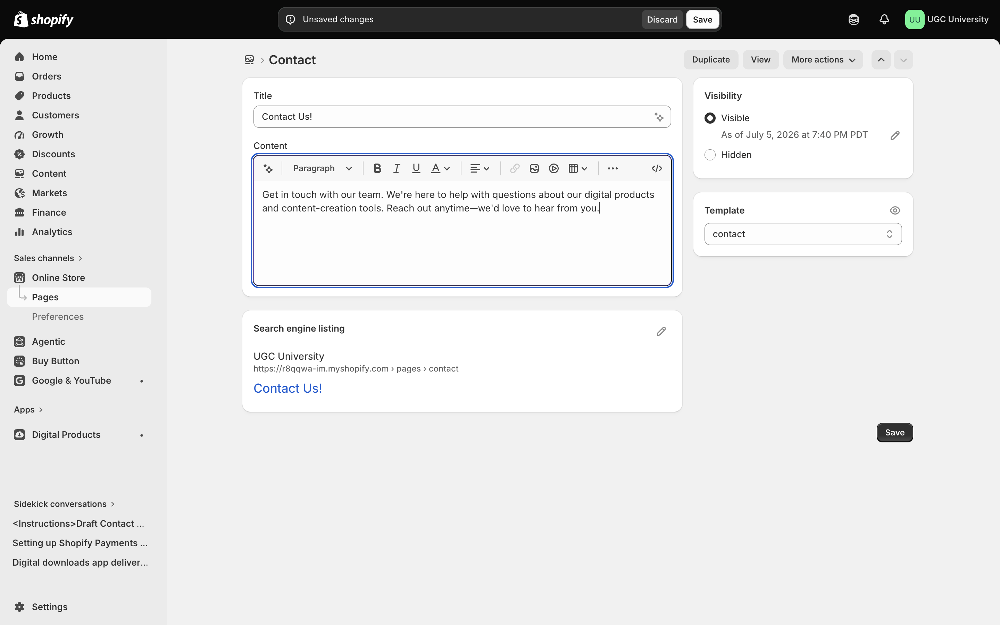

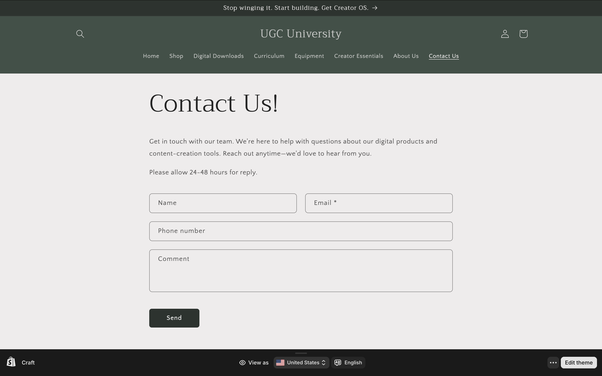

# **Trust signals reflection**

> Write one paragraph explaining how your policies and store information could make customers feel more confident.

The policies and store information outlined in my shop build trust with consumers by setting clear expectations from the time an order is placed, through fulfillment, and following delivery.

Products that are digital or print on demand are clearly defined, while drop shipped order have a place of origin. When orders are placed, delivery dated are defined automatically based on fulfillment history, which eliminates the potential to over promise and under deliver.

Customers are also informed of how their information will be used based on Shopify's policies, which are in place to protect all parties involved, and as such are not subject to revision.

Contact information and channels are available with notice of response time in addition to clearly defined return, exchange and refund policies. This information sets customer expectations post-purchase, letting them know that service and satisfaction are guaranteed and backed by real people.

# **CPP Farm Store application reflection**

> Write one paragraph explaining which trust signals would be especially important for CPP Farm Store.

Trust signals are especially important for the Farm Store as their customers have experienced mild dissatisfaction in the fulfillment phase of their buyer's journey when purchasing gift baskets due to their analog ordering process.

The Farm Store would especially benefit from defined fulfillment duration at the time of order placement, a return/exchange/refund policy, and direct contact information outside of the email process.

# Appendix

- [GitHub Repo](https://github.com/lewiswaddell/ITP-W08.git)

- [GitHub Pages](https://lewiswaddell.github.io/ITP-W08/)
